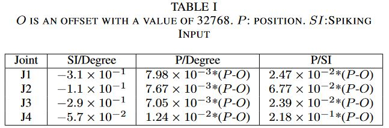
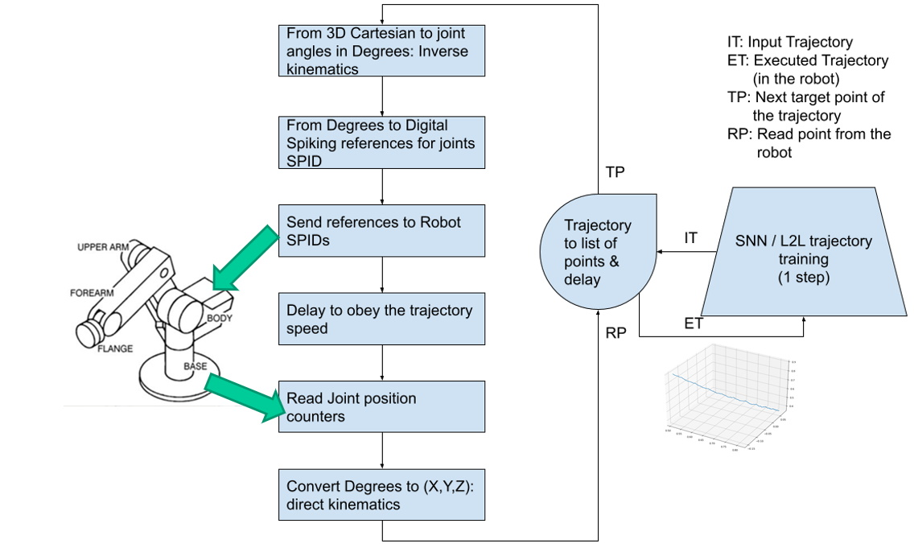
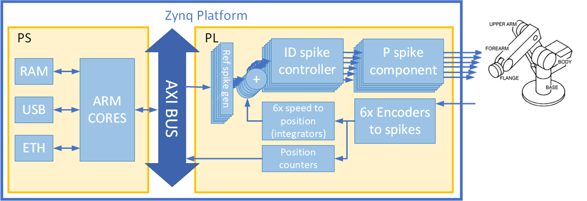
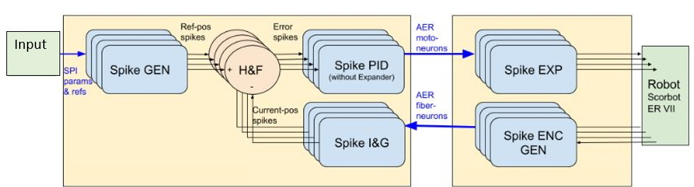
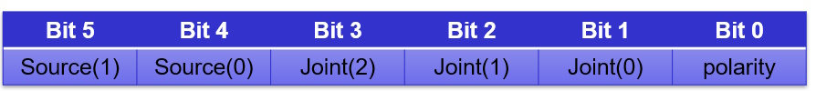
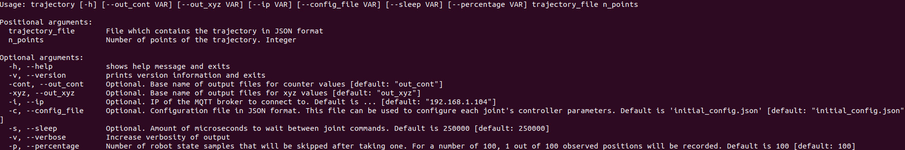

.. include:: <isoamsa.txt>

Data types
===============

In this work we treat different types of data due to the constraints imposed by the interface between the arm and the controller. Theoretically, we work with trajectories
in cartesian tridimensional space, however this kind of data can't be directly understood by the robot. That is why, first, we need to convert the points in 3D space
to a series of joint angles that the robot can execute, and this is done through the inverse kinematics equations of the robot. Other robots might be able to use this
information, angle joints in **[q1,q2,q3,q4]** format (*see Dataset format section for further explanation*), directly, but again due to the controller's infrastructure,
we need to take one more step. This last step would be to convert the angle joints in **[q1,q2,q3,q4]** format and convert them to spiking references in a similar format,
**[j1,j2,j3,j4]**. These values are just integer numbers which correspond with the generation of a specific frequency for each of the robot's joints. With these data in hand,
now the trajectory can be executed (further instructions on how to actually perform a trajectory below). Lastly, we get an output file with the position data for each of
the robot's joints during the time the trajectory was executed, and this file offers data with yet another data type, counters (**[c1,c2,c3,c4]**). These three data types, angles, references 
and counters, have a linear relationship between themselves, which means we are able to convert from angles to references and back from counters to angles. For further information,
please refer to the specific section of each data type.

.. En este trabajo tratamos con diferentes tipos de datos debido a las restricciones de la interfaz entre el brazo y la controladora. Rápidamente y por encima,
.. de forma teórica trabajamos con trayectorias cartesianas pero esto no sirve directamente para trabajar con el robot. Primero hay que convertir los puntos en el espacio
.. tridimensional a ángulos ejecutables por el robot, esto se hace con la cinemática inversa de este. Otros robots quizá puedan utilizar estos datos directamente, pero 
.. dada la infraestructura de la controladora del ED-Scorbot, necesitamos un paso más para poder tener los datos en una forma entendible por el brazo, esto es, convertir 
.. los ángulos calculados en el paso anterior a referencias digitales. Por último, recogemos los valores de la ejecución del movimiento en otro formato distinto, el de los contadores.
.. Todo esto viene ilustrado en la figura .... . Para más detalles, consultar la sección específica de cada tipo de dato.

Angles (**qX**)
----------------

Angles in the robot's workspace, usually expressed in the following format: **[q1,q2,q3,q4]**. In general, any trajectory can use any number of joints needed, but it is
important to know that the controller's handler software is prepared to use trajectories in the format **[q1,q2,q3,q4,q5,q6]**, as the EDScorbot has 6 joints in total (although 
only four of them are relevant for calculating the end-effector position). This means that, for trajectories that do not use all 6 joints, it is necessary to add padding to the
original input data. There are specific scripts to handle the data in this way, please refer to **Conversion** section for more details and this  `link <https://github.com/RTC-research-group/Py-EDScorbotTool/tree/dev/pyEDScorbotTool/utils/transformations>`_ for conversion scripts.

.. Ángulos en el espacio de trabajo del robot. Suelen venir expresados en la forma [q1,q2,q3,q4]. En general, cualquier trayectoria puede usar las articulaciones que se
.. consideren necesarias, pero es importante tener en cuenta que el software de gestión de la controladora está preparado para recibir siempre trayectorias en el formato
.. [q1,q2,q3,q4,q5,q6]. Esto significa que, para trayectorias que no usen todas las articulaciones, es necesario añadir un relleno (padding) a los datos de entrada originales.
.. Existen funciones para ello en la ruta ... PONER LA RUTA DE LOS SCRIPTS

References (**jX**)
--------------------
Position digital input for the controller. This is an integer number that generates a spike train with a certain frequency, depending on the reference (refer to [Theory]_ and [HW_Impl]_
for more details on spike generation). For this work, this is considered to have a linear relationship with the position in degrees of each joint. Therefore, a mathematical
linear relationship can be established for each joint between its position in angles and its digital reference input. See **Conversions** section for more detail on conversions 
and `this link <https://github.com/RTC-research-group/Py-EDScorbotTool/tree/dev/pyEDScorbotTool/utils/transformations>`_ for conversion scripts.

.. Entrada digital de posición para la controladora. Se trata de un número entero que genera un tren de pulsos de una frecuencia determinada. Tiene una correspondencia 
.. directa (y prácticamente lineal) con la posición en ángulos de la articulación que se mueve.

Digital Counters (**cX**)
--------------------------
16-bit digital registers of the FPGA/PL in which the position of each joint is stored at any given moment. This is a "memory" implementation in order to have constant
feedback of the position of the arm at any time, because the only real feedback the robot provides is an optical encoder per joint. These encoders are used to increment
or decrement the value of the registers (becoming therefore, counters) depending on the motion of the movement of each joint's motor (forwards/backwards). This is the 
format the output data that is read from the robot is in, and it is **[c1,c2,c3,c4,c5,c6]** per timestep. This change See **Conversions** section for more detail on conversions 
and this `link <https://github.com/RTC-research-group/Py-EDScorbotTool/tree/dev/pyEDScorbotTool/utils/transformations>`_ for conversion scripts. Additionally, a timestamp 
may be included in each point so that we can relate each point of the trajectory in time.

.. Registros digitales de 16 bits en los que se almacena la posición de cada una de las articulaciones. Es el formato de los datos de salida una vez se ha ejecutado
.. una trayectoria. Esto es una implementación de "memoria" para poder tener constancia de la posición del brazo en cada momento, ya que el único feedback disponible 
.. desde el brazo es un encoder óptico por articulación. Estos encoders se utilizan para incrementar o decrementar el contador en función del sentido del movimiento.

------------
All these types of data, while different, derive from the same concept: to describe the absolute position (as opposed to relative position) of every joint of the robot.
To be able to transform them to one or more of the other types, the following experimental values have been obtained:

.. =====  =========  ========  =====
.. Joint  SI/Degree  P/Degree  P/SI
.. =====  =========  ========  =====
.. J1     \\num{-3.1e-1}      False     Fals
.. J2      False      False     Fals
.. J3      True       False     Fals
.. J4      True       True      True
.. =====  =========  ========  =====

   Conversion data obtained experimentally. Table extracted from https://doi.org/10.48550/arXiv.2204.00121.

If we analyzed this situation a bit, taking into account the way the whole system works, we can create a small diagram to show the motivation for these conversions,
as well as the workflow that imposes these constraints on the system:

   Data Type conversion overview as well as workflow order.
  
   * Step 0 - Create/Obtain a trajectory in 3D space and convert it to Qx angles with the robot's inverse kinematics
   * Step 1 - Convert Qx angles into references (scripts are provided to perform this step)
   * Step 2 - Execute trajectory using references as the controller's input (robot needed for this step) and collect data from the run
   * Step 3 - Convert the collected data back to Qx angles representation in order to analyze it or compare it against original trajectory data
   
   Any step with a red arrow is, in general, a non-typical or unneedful step, as the conversions performed in those are not really required neither for the 
   system to work nor for the evaluation of the system's output.

.. .. [angles] -> [refs]       OK
.. .. [counters] -> [angles]   OK
.. .. [angles] -> [refs]       ??
.. .. [counters] -> [refs]     ??
.. .. [angles] -> [counters]   ??
.. .. [refs] -> [counters]     ??

.. .. figur 
..    :scale: 60%
..    :alt: Typical workflow for the execution of a given trajectory
..    :align: left

..    Typical workflow for the execution of a given trajectory. Steps are ordered as shown in the picture.

.. Todos estos tipos de datos, si bien son fundamentalmente diferentes, hacen referencia al mismo concepto: la posición absoluta de cada una de las articulaciones del
.. brazo. Se han obtenido experimentalmente los siguientes valores de conversión entre datos:

.. TABLA CONVERSIONES

Controller Infrastructure
=========================
The current controller's infrastracture is composed by the following elements, all inside an Avnet Mini-Module-Plus Zynq-7000® All Programmable SoC Plus 7Z100 (MMP).
You can check the system's overview in the following picture. To summarise, the Zynq device used contains both a Programmable Logic part (which can be seen as a traditional
FPGA) as well as a Processing System part (which can be seen as a traditional set of ARM CPUs), which makes for a very convenient infrastracture, as only one device (apart
from the robot) is needed to implement both the controller and the controller's handling software.

   System logical overview

Programmable Logic (PL)
------------------------
In this part of the system, the actual controller is implemented. In fact, there are six different controller modules, one for each operable joint, so when we normally
refer to *the controller* we really mean the collection of the six controller modules inside the PL. This controller is implemented following details from the following 
articles: [SPID]_, [Position_SPID]_ , and it is effectively a **position-based controller**, which means that its input can be interpreted as the robot's position.
 

Next there is a picture of the controller's modules logical overview.

   Controller's logical overview

Processing System
-------------------
For the "traditional" part of the MPSoC, we use a minimal, lightweight, custom built distribution of Linux that is obtained from the use of the `PetaLinux Xilinx tool <https://www.xilinx.com/products/design-tools/embedded-software/petalinux-sdk.html>`_. 
This operating system provides us with basic functionalities such as network management, filesystem, console utilities, etc., as it is in
fact a Linux operating system, only that it has been stripped off of everything deemed unnecessary just for the execution of the system, therefore some popular Linux
distributions applications and/or configurations may not apply in this context. What this really means is that everything we put into the system must be tailor-fitted for the system's needs, which effectively slows the development process when, for
example, a program needs certain system libraries to work, because then the whole system has to be rebuilt in order to include the needed libraries. 

The controller's handler software is run inside the Processing System and on top of the Linux distribution just described. The best way to implement a relatively high-level
application that still maintains high execution speed is to write it in C/C++. This doesn't render the original Python application useless, but it certainly assumes
the responsibility for managing the controller's behaviour, making the original application (not) just an interface for this C/C++ runtime. Documentation on how to use
this runtime is available in the correspondent API section, and information about how a custom program could be made can be found checking the default implemented scripts
in the repository (`Source <https://github.com/RTC-research-group/Py-EDScorbotTool/tree/dev/c/src>`_).

.. note::
  A little bit more information on the scripts section of the repository

  - **EDScorbot**

    Basic library for the controller

  - **mqtt_server**

    MQTT Server to allow for constant feedback between graphical interface and Linux C/C++ runtime

  - **python_utils** (**To be changed**)

    Different utilites in Python, from conversion scripts to visualization scripts

  - **scripts**

    Default scripts for convenience. Examples: 
      
    * **home.cpp** -- Perform home procedure (each joint finds its home and sets it)
    * **read_joints.cpp** -- Read all joints and prints it to standard output
    * **reset_all.cpp** -- Perform a reset of the SPID modules fo the controller, setting the counter's position at the moment of the reset as the digital input *0*
    * **SendRefJx.cpp** -- Send an input to one joint
    * **send_0.cpp** -- Send the input 0 (should be home position) to all joints
    
  - **trajectory**

    Main application for executing trajectories

Dataset format
===============
This section describes the files that are to be provided, as well as those collected from the execution, in order to successfully create a record for the SMALL dataset.
All of these files will be included for each dataset sample, and will constitute the sample itself.

.. Files and the data they have inside

Recordings
==========
In order to generate a sample (or samples) for the dataset, it is necessary to provide several data:

* Input Data

  A file with angle values in **[q1,q2,q3,q4]** format, although less joints can be used. A file with the original trajectory described in 3D coordinates can 
  also be provided for clarity, but it is not needed. Usually in .npy format (NumPy file format).
  
* Output Data

  * A JSON file with the output data from a trajectory execution in the robot in **[j1,j2,j3,j4,j5,j6,timestamp]** format.
  * An AEDAT file with the information of the controller's spiking activity during trajectory execution. The data inside this files is arranged in packets of 6 bits. Refer to figure :numref:`aedat_format` for more details. 
  * MP4 Recordings from all 3 points of view (can be seen as X,Y,Z axes).

.. **ALGO MAS??**

   Format of packages inside .AEDAT files. These are 6 bits packages with information relating to various sources of information.

In the following sections, directions are provided for every step of the workflow process (see image in *Conversions* section). From now on, we will assume that
all work is done in Python using the NumPy library, except for those steps that are specifically executed in the Zynq's C/C++ runtime. So, when we say "the result should
be an array in X format" that is a NumPy array, which can be directly stored into a file with the ``numpy.save`` utility function.

Trajectory generation
---------------------
This may be the most generic step of the whole process, as the only result we need here is a trajectory in 3D space. This can be easily fit into a NumPy file that stores
an array in **[x,y,z]** format with **N** points. So, pick your favorite (or most convenient) 3D shape, generate it in Python so that it can be plotted in a graph with
matplotlib for example, and you should be OK. A sample file with a lemniscate trajectory (eight-shaped) is provided `here <https://lara.eii.us.es/cloud/sharing/NOeFBqUzc>`_. The contents of this file
can be represented using the GUI (function ``Plot 3D Trajectory``) or using the functions provided in ``pyEDScorbotTool.utils.transformations`` submodule.

Data type conversion
---------------------
We can divide the different data conversions in different steps, as each one has its own motivation.

* 3D Coordinates |srarr| Joint angles

  This conversion is due to the controller's interface not being able to recognize 3D points in space as its input. An ideal method would be for the controller to accept **(X,Y,Z)** coordinates as inputs. 
  However, the controller doesn't work this way, so first we need to obtain the joint angles **(qX)** that make the robot perform a specific trajectory. For this step, we need to use the concept of **Inverse Kinematics**.
  There are several methods when calculating the inverse kinematics of a robot, including both numerical methods and analytical methods. Currently, only one method has been used to record trajectories
  ant it has been the numerical one, using the utilities provided in the `visual_kinematics <https://github.com/dbddqy/visual_kinematics>`_ package. More information on this on the **Data Analysis** section.
  The result should be an array in  **[q1,q2,q3,q4]** format with **N** number of known points. 

  .. For this step, check the script provided `here <>`_. These scripts make use of the robot's inverse kinematics equations (described `in here <>`_) to transform in between these data types.

* Joint angles |srarr| Digital Input (Reference)

  This conversion is motivated again by the controller's interface not being able to receive data in the angle space of the robot, but rather in a digitally synthetic way. The 
  relationship between these data is described above in section **References**. For this step, check the scripts provided in the **python_utils/transformations** directory (`Source <https://github.com/RTC-research-group/Py-EDScorbotTool/tree/dev/pyEDScorbotTool/utils/transformations>`_).
  The result should be an array with **[j1,j2,j3,j4,j5,j6]** format with the same **N** number of points the trajectory had in the beggining. This array, while it has been obtained by default
  in Python and is originally a NumPy array, must be converted to a JSON file to be compatible with the controller's runtime.

* Counters output |srarr| Joint angles

  Finally, this last conversion is necessary because the controller's output is not directly interpretable, as it is just a series of numbers ranging from 0 to 65535
  (remember counters are just 16-bit registers). The result should be an array with **[q1,q2,q3,q4,q5,q6,timestamp]** format with the same **N** 
  number of points the trajectory had in the beggining.  For this step, check the scripts provided in the **python_utils/transformations** directory 
  (`Source <https://github.com/RTC-research-group/Py-EDScorbotTool/tree/dev/pyEDScorbotTool/utils/transformations>`_).

* **Optional** Source Angles |srarr| 3D Trajectory

  This additional conversion method can be used to revert a file containing data in **[q1,q2,q3,q4]** format back to a trajectory in cartesian space, for later visualization.
  For this step, check the scripts provided in the **python_utils/transformations** directory (`Source <https://github.com/RTC-research-group/Py-EDScorbotTool/tree/dev/pyEDScorbotTool/utils/transformations>`_).
  The result should be an array with **[x,y,z]** format with the same **N** number of points the trajectory had in the beggining.  

Execution and data collection
------------------------------

For the execution of the trajectory, we need a JSON file with **N** known data points, each point being in format **[j1,j2,j3,j4,j5,j6]**. Then, the ``trajectory`` script
can be used. Here's the information displayed by the application's command line interface:

Now there can be two ways a trajectory can be collected. There are two data feedbacks that the ``trajectory`` script provides:

* **JSON counters file**

This is the counters file that is discussed in the above sections. It contains a fine-granulated version of the trajectory execution, as position collection happens
continuously while the robot is moving. Please note that, of all of the positions that can be taken inside the ``sleep`` time, only a small percentage of them are taken, 
which is defined by the ``perc`` parameter in the script. This is because the time that it takes for the device to check for a position is so fast that if we were to take
all of the data produced, the output file would be massive. The default percentage of taken data from the whole is a mere 1%, but feel free to modify this value to your will.
Just ensure that the amount of storage of the system is enough to provide for the generated data. This value has been chosen because, experimentally, gives more than enough points
to fill all the gaps in a life scaled representation of the trajectory.

* **MQTT Data**

The ``trajectory`` script also provides another method of feedback through the use of the MQTT protocol. This is done in a per-point basis when performing the trajectory,
so one should expect to receive the exact **N** number of points of the commanded trajectory. The topic the data is published to is ``EDScorbot/trajectory``, and the data
format is ``[c1,c2,c3,c4,c5,c6,i]``, with ``i`` being the iteration number of the trajectory's execution. Any one that is able to connect to the provided broker [#]_ can subscribe to the specified topic, receive the data and then store them however is needed. The graphical interface provided in the Python tool
allows for this data collection method.

Once we have the collected data, the next and last step is to analyse it. 

.. [#] The broker will be provided in the future when a service becomes available. Currently, all jobs are performed with laboratory staff in place to take care that everything is OK. If you are interested in using the robot or the dataset, contact epinerof@us.es or alinares@us.es.

Data Analysis
--------------
Once the trajectory has been executed and collected, we need to inspect the data and compare it to the original input data in a similar representation to that of the latter.
There are a lot of comparisons that can be made, and given that we are handling 3 or 4 different data types, the combination of comparisons is a big number, which means
that it is difficult to implement one only program that can handle each and every combination of comparison data. Therefore, this section will include a list of scripts
and examples to illustrate some of the different comparisons that have proved to be significant to the evaluation of a trajectory's execution.

.. important:: 

  **Work in progress**

Bibliography
=============

.. [SPID] https://www.mdpi.com/1424-8220/12/4/3831

.. [Position_SPID] https://www.frontiersin.org/articles/10.3389/fnbot.2020.590163/full

.. [Theory] https://ieeexplore.ieee.org/abstract/document/1629098

.. [HW_Impl] https://link.springer.com/chapter/10.1007/11494669_66